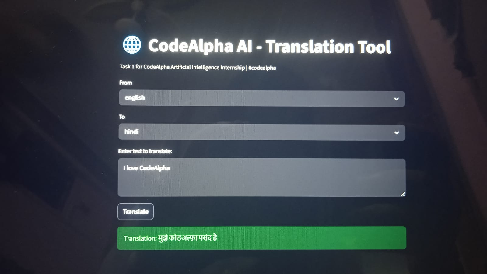

# CodeAlpha AI - Translation Tool 🌐

Task 1 for CodeAlpha Artificial Intelligence Internship

## 📌 Overview
A Language Translation Tool built using Python, Streamlit, and Deep Translator API. Users can translate text between multiple languages with auto-detection.

## ✨ Features
- Auto language detection
- Supports English, Hindi, Spanish, French, German
- Clean Streamlit UI
- Real-time translation

## 🛠️ Tech Stack
- Python
- Streamlit 
- Deep Translator API

## 🚀 How to Run
```bash
pip install streamlit deep-translator
streamlit run app.py
```


## 📸 Demo Screenshot


**Submitted by:** Roshni Lodhi
#codealpha #artificialintelligence #python #streamlit
